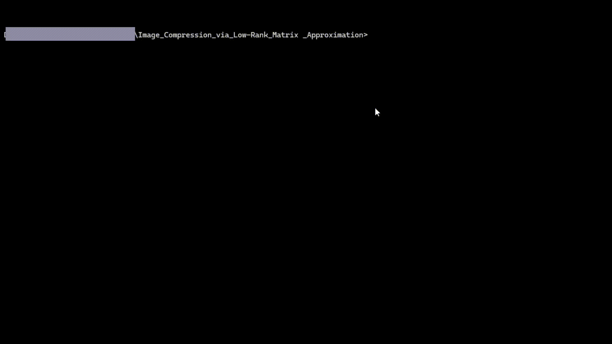

# Image Compressor with SVD from Scratch

This is a full-stack web application that demonstrates the concept of lossy image compression using Singular Value Decomposition (SVD). The core SVD algorithm is implemented from first principles using Python and NumPy, without relying on high-level library functions like `np.linalg.svd`.

This project serves as a practical application of fundamental linear algebra concepts to a real-world problem in data science and signal processing.

## 🚀 Features

* **Interactive Web Interface:** A clean, modern UI built with HTML, CSS, and vanilla JavaScript.
* **Drag-and-Drop File Upload:** Easily upload images for compression.
* **Real-Time Quality Control:** An interactive slider allows the user to select the number of singular values (`k`) to retain, controlling the trade-off between quality and compression.
* **Side-by-Side Comparison:** Instantly view the original image next to the reconstructed, compressed version.
* **From-Scratch Algorithm:** The SVD engine is built from the ground up using eigendecomposition of the covariance matrix (`AᵀA`), showcasing a deep understanding of the underlying mathematics.

## 🧠 How It Works

The application treats any grayscale image as a single matrix **A**. The core of the project is a custom-built Singular Value Decomposition (SVD) engine that factorizes this matrix into its constituent components: **U**, **S**, and **Vᵀ**.

$$ A = U S V^T $$

* **U** and **Vᵀ** represent the fundamental vertical and horizontal patterns of the image.
* **S** contains the singular values, which act as "importance scores" for each of these patterns.

Compression is achieved by **truncating** these components. By keeping only the top `k` most important patterns (as determined by the `k` largest singular values), we can reconstruct an approximation of the original image that requires significantly less data to store. A lower `k` results in higher compression but lower visual quality, while a higher `k` results in a more faithful reproduction at the cost of a larger size.

## 🛠️ Technology Stack

* **Backend:** Python 3, Flask, NumPy, Pillow
* **Frontend:** HTML5, CSS3, Vanilla JavaScript

## 🔧 Setup and Installation

To run this application locally, follow these steps:

1.  **Clone the repository:**
    ```bash
    git clone <your-repository-url>
    cd <your-repository-name>
    ```

2.  **Create and activate a virtual environment (recommended):**
    ```bash
    python -m venv venv
    source venv/bin/activate  # On Windows, use `venv\Scripts\activate`
    ```

3.  **Install the dependencies:**
    ```bash
    pip install -r requirements.txt
    ```

4.  **Run the Flask application:**
    ```bash
    python app.py
    ```

5.  **View the application:**
    Open your web browser and navigate to `http://127.0.0.1:5000`.

##  kullanım

1.  Drag and drop an image file onto the designated area, or use the upload button to select a file.
2.  Once the preview appears, adjust the "Quality (k)" slider to select your desired level of compression.
3.  The compressed image and statistics will appear on the right side of the screen.

## SEE demo of my app:



#Thank you!